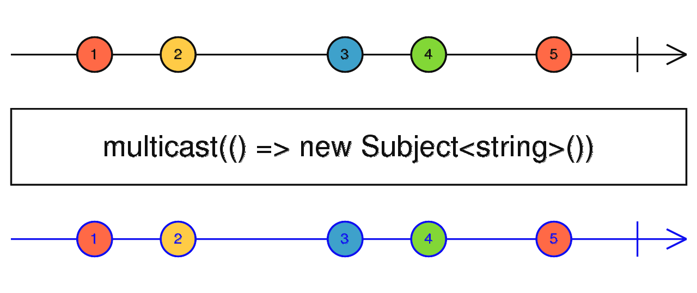
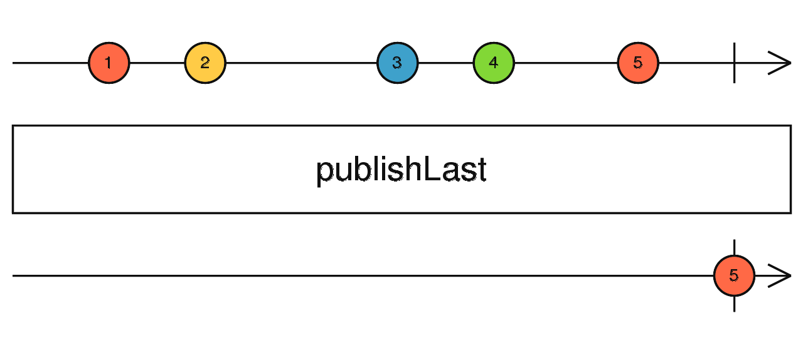
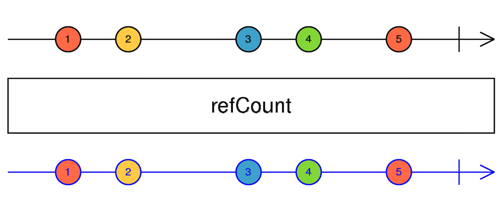
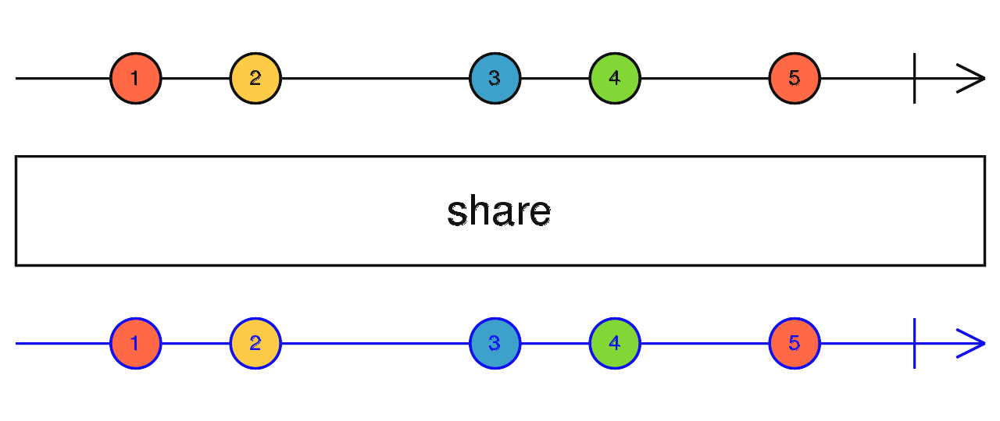

# 主题和多播 Subject & multicast

主题（Subject）是什么？在 RxJS 中，主题是一种特殊类型的可观察对象——允许将值发送给多个观察者。我们知道普通的可观察对象是单播（unicast）（每个已订阅的观察者拥有独立的可观察对象执行上下文），而主题是多播的。

> A Subject is like an Observable, but can multicast to many Observers. Subjects as like EventEmitters: they maintain a registry of many listeners.

**Every Subject is an Observable.** Given a Subject, you can **subscribe** to it, Providing an Observer, which start receiving value normally. From the perspective of the Observer, it cannot tell whether the Observable execution is coming from a plain unicast Observable or a Subject.

Internally to the Subject, **subscribe** does not invoke a new execution that delivers value. It simply registers the given Observer in a list of Observers, similarly to how **addListener** usually works in other libraries and languages.

**Every Subject is an Observer.** It is an object with the methods **next(v)**, **error(e)**, and **complete()**. To feed a new value to the Subject, just call **next(theValue)**, and it will be multicasted to the Observers registered to listen to the Subject.

## `multicast()`

返回一个新的可连接的可观察对象（ConnectableObservable），它只会对源可观察对象进行一次订阅，并会将源观察对象的值发送给多个订阅者。

## `publish()`

`publish()`相当于`multicast()`。

`publishLast()`:

`publishReplay()`:

与`publish()`类似，但是它会保留所有的源可观察对象发出的值，并会给所有的观察者发送所有保留的值，就算源可观察对象已经发送值或者已经取消订阅了源可观察对象之后再订阅的观察者一样如此。

`publishBehavior()`:

与`publish()`类似，但是它会保留源可观察对象发出的最新的值，并会给发送值之后的观察者发送这个最新的值。

## `refCount()`

让一个可连接的可观察对象（ConnectableObservable）表现得像普通的可观察对象，并且会自动关联。

在内部它会计数可观察对象的订阅者数量，并且如果订阅者计数大于 0，则会订阅一次源观察对象，并且只有一次订阅。如果订阅者小于 1，它会取消从源可观察对象的订阅。这样，您可以确保发布的 refCount 之前的所有内容都只有一个订阅，而与目标可观察对象的订阅者数量无关。

## `share()`

返回新的可观察对象，它可以多播（分享）原始的可观察对象。只要有一个观察者，就会订阅原始的可观察对象并且发送数据。当所有的观察者取消了订阅后，它则会取消订阅原始的可观察对象。它相当于`multicast(() => new Subject()), refCount()`。

`shareReplay()`与`share()`类似，但是会它保留原始可观察对象发出的所有的值，并会发送给后来订阅的观察者。
